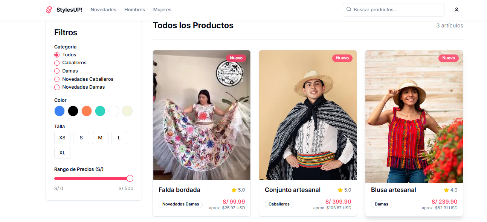

# Proyecto de E-commerce

Este es un proyecto de comercio electrónico de ropa moderna para hombre y mujer.

## Cómo ejecutar el proyecto

Sigue estos pasos para ejecutar el proyecto en tu entorno de desarrollo local.

### Prerrequisitos

Asegúrate de tener [Node.js](https://nodejs.org/) instalado en tu sistema.

### Instalación

1.  Clona el repositorio en tu máquina local.
2.  Abre una terminal en el directorio raíz del proyecto.
3.  Instala las dependencias del proyecto ejecutando el siguiente comando:

    ```bash
    npm install
    ```

### Ejecución

Una vez que las dependencias se hayan instalado, puedes iniciar el servidor de desarrollo con el siguiente comando:

```bash
npm run dev
```

La aplicación estará disponible en [http://localhost:9002](http://localhost:9002).

## Captura de pantalla


# D-CULTURAS
# D-CULTURAS
# D-CULTURAS
# D-CULTURAS
